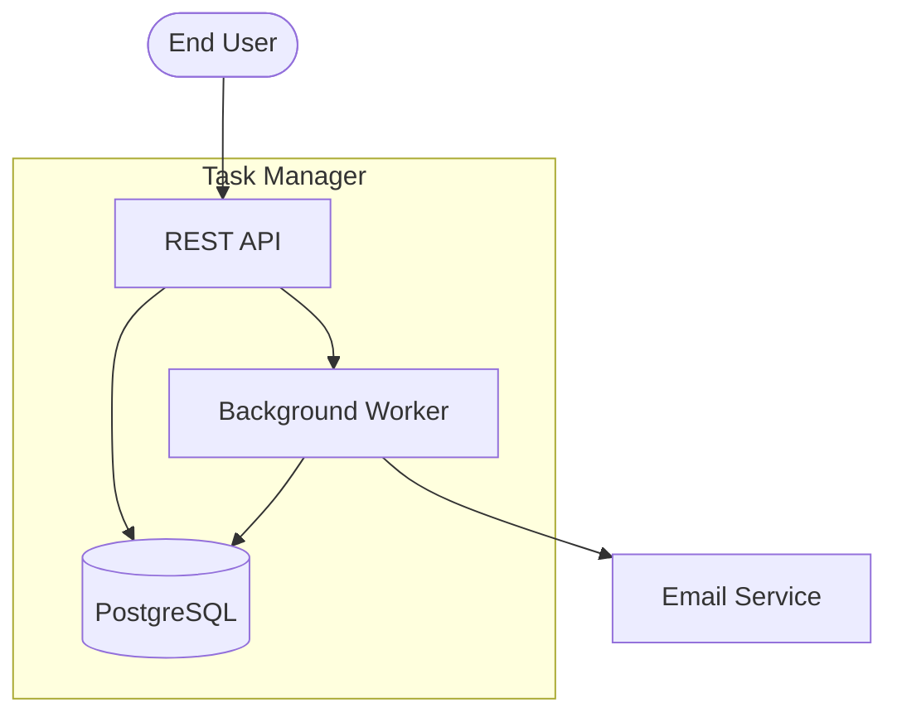

# PROJECT_ARCHITECTURE_BASELINE

**Status:** active
**Owner:** User
**Last Updated:** 2026-03-22

> Agents MUST NOT edit this directly. Use ARCHITECTURE_CHANGE_PROPOSAL to suggest changes.

---

## 1. System Topology

## 2. Key Architectural Decisions

1. Monolithic backend — single deployable unit
2. PostgreSQL as sole persistent store
3. Server-rendered HTML — no SPA framework
4. Background jobs via in-process queue, no external broker

## 3. Non-Negotiable Structural Boundaries

1. Auth module is separate from business logic
2. All external service calls go through a gateway layer
3. Database access only through repository pattern

## 4. Canonical Workflows

Task creation: User → API → DB → Worker → Email

## 5. Canonical Data Flows

All writes go through API → Repository → PostgreSQL. Background worker reads from DB, never from API.
