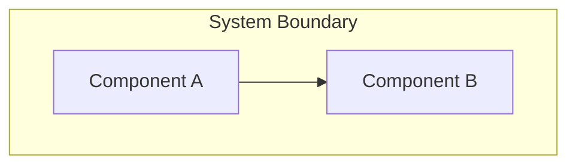

# PROJECT_ARCHITECTURE_BASELINE

**Status:** proposed
**Owner:** User
**Last Updated:** YYYY-MM-DD
**Authority Tier:** 0.8 (below BASELINE_INTERPRETATION_LOG, above SYSTEM_GOAL_PACK)

> This is a user-owned document. Agents MUST NOT edit it directly.
> To propose changes, use ARCHITECTURE_CHANGE_PROPOSAL.md.
> This document constrains the architectural floor — it does not define detailed architecture.
> Detailed architecture is derived in SYSTEM_ARCHITECTURE.md (Tier 2).

---

## 1. System Topology

<!-- One high-level Mermaid diagram showing major components and their relationships -->
<!-- Maximum 1 diagram in this section -->

## 2. Key Architectural Decisions

<!-- 3-7 structural choices, one line each -->
<!-- Example: "Monolithic backend, single deployable unit" -->

1. <!-- Decision 1 -->
2. <!-- Decision 2 -->
3. <!-- Decision 3 -->

## 3. Non-Negotiable Structural Boundaries

<!-- 3-7 rules that downstream agents must not violate -->
<!-- Example: "Auth is a separate module from business logic" -->

1. <!-- Boundary 1 -->
2. <!-- Boundary 2 -->
3. <!-- Boundary 3 -->

## 4. Canonical Workflows

<!-- 1-3 critical workflows using Mermaid sequence diagrams -->
<!-- These define the expected interaction paths that module contracts must respect -->

## 5. Canonical Data Flows

<!-- 1-3 critical data flows -->
<!-- These define how data moves through the system at a high level -->
